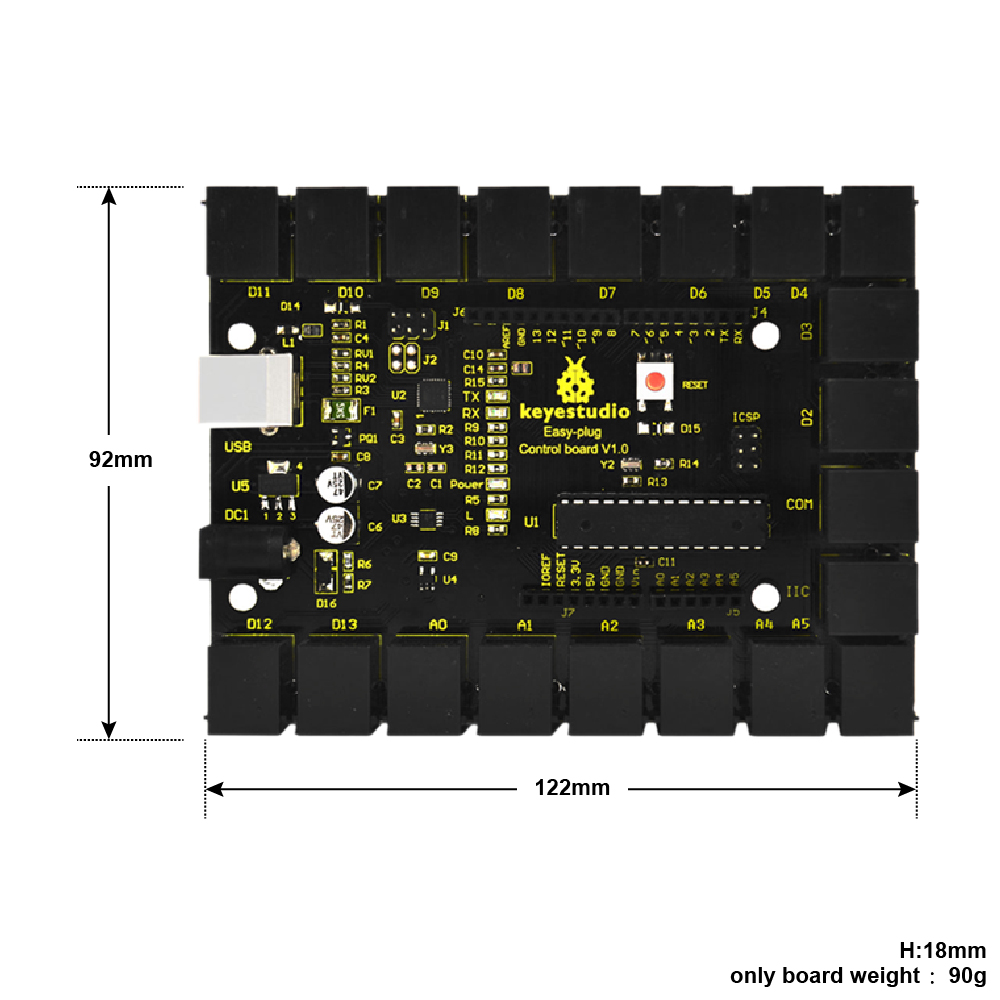
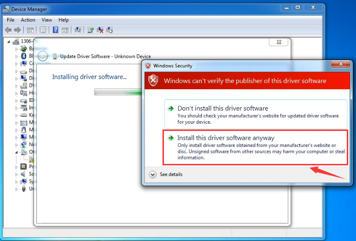

# **Keyestudio EASY plug Control Board V1.0**

****

## Introduction:

Keyestudio Easy-plug control board is a microcontroller board based on the
ATmega328P-PU
([datasheet](http://www.atmel.com/images/Atmel-8271-8-bit-AVR-Microcontroller-ATmega48A-48PA-88A-88PA-168A-168PA-328-328P_datasheet_Complete.pdf)).
It has 14 digital input/outputs (of which 6 can be used as PWM outputs), 6
analog inputs, a 16 MHz quartz crystal, a USB connection, a power jack, an ICSP
header and a reset button.

It contains everything needed to support the microcontroller; simply connect it
to a computer with a USB cable or power it with a AC-to-DC adapter or battery to
get started.

For convenience of wire connection, we simplify the pins GND and VCC into each
plug, so you only need one RJ11 6P6C connector wire to connect a module, no need
to separately connect the VCC and GND.

The pins on the original UNO are all redesigned into plug interface. On the
board, you can find ports D2-D13, A0 to A5, an IIC port and a COM port. All in
one simple plug.

**Note:** you should use the RJ11 6P6C connector wire to connect other modules
to the board.

## Specifications:

| **Microcontroller**             | ATmega328P-PU                            |
|---------------------------------|------------------------------------------|
| **Operating Voltage**           | 5V                                       |
| **Input Voltage (recommended)** | DC7-12V                                  |
| **Digital I/O Pins**            | 14 (of which 6 provide PWM output)       |
| **PWM Digital I/O Pins**        | 6 (D3, D5, D6, D9, D10, D11)             |
| **Analog Input Pins**           | 6                                        |
| **DC Current per I/O Pin**      | 20 mA                                    |
| **Flash Memory**                | 32 KB of which 0.5 KB used by bootloader |
| **SRAM**                        | 2 KB                                     |
| **EEPROM**                      | 1 KB                                     |
| **Clock Speed**                 | 16 MHz                                   |

## Details:

-   PCB Dimensions: 122mm x 92mm x 18mm

-   Weight: 90g

## Element and Interfaces:

Here is an explanation of what every element and interface of the board does:

## Specialized Functions of Some Pins:

-   **SPI communication:** D10 (SS), D11 (MOSI), D12 (MISO), D13 (SCK).

-   **IIC communication:**  A4 (SDA); A5(SCL)

-   **Serial communication:** Digital pins 0 (RX) and 1 (TX).

-   **PWM (Pulse-Width Modulation):** D3, D5, D6, D9, D10, D11

-   **External Interrupts:** D2 (interrupt 0) and D3 (interrupt 1). These pins
    can be configured to trigger an interrupt on a low value, a rising or
    falling edge, or a change in value.

-   **SPI communication:** D10 (SS), D11 (MOSI), D12 (MISO), D13 (SCK). These
    pins support SPI communication using the SPI library.

-   **IIC communication:** A4 (SDA); A5(SCL)

## Detailed Use with ARDUINO Software as follows:

#### Step1\| Download the Arduino IDE

When you get the board, first you should install the Arduino software and
driver.

We usually use the Windows software Arduino 1.5.6 version. You can download it
from the link below:

[https://www.arduino.cc/en/Main/OldSoftwareReleases\##1.5.x](https://www.arduino.cc/en/Main/OldSoftwareReleases##1.5.x)

Or you can browse the ARDUINO website to download the latest version from this
link, <https://www.arduino.cc>, pop up the following interface.

Then click the **SOFTWARE** on the browse bar, you will have two options ONLINE
TOOLS and DOWNLOADS.

Click **DOWNLOADS**, it will appear the latest software version of ARDUINO 1.8.5
shown as below.

In this software page, on the right side you can see the version of development
software for different operating systems. ARDUINO has a powerful compatibility.
You should download the software that is compatible with the operating system of
your computer.

We will take **WINDOWS system** as an example here. There are also two options
under Windows system, one is installed version, the other is non-installed
version.

For simple installed version, first click **Windows Installer**, you will get
the following page.

This way you just need to click JUST DOWNLOAD, then click the downloaded file to
install it.

For non-installed version, first click Windows ZIP file, you will also get the
pop-up interface as the above figure.

Click JUST DOWNLOAD, and when the ZIP file is downloaded well to your computer,
you can directly unzip the file and click the icon of ARDUINO software to start
it.

**Installing Arduino (Windows):**

Install Arduino with the exe. Installation package downloaded well.

Click *“I Agree”* to see the following interface.

Click *“Next”*. Pop up the interface below.

You can press Browse… to choose an installation path or directly type in the
directory you want. Then click “Install” to initiate installation.

Wait for the installing process, if appear the interface of Window Security,
just continue to click Install to finish the installation.

**Introduction for Arduino IDE Toolbar:**

Double-click the icon of Arduino software downloaded, you will get the interface
shown below.

(Note: if the Arduino software loads in the wrong language, you can change it in
the preferences dialog. See [the environment
page](http://arduino.cc/en/Guide/Environment##languages) for details.)

The functions of each button on the Toolbar are listed below:

<http://wiki.keyestudio.com/index.php/File:IDE.png>

| ****  **Verify/Compile** | Check the code for errors                           |
|-------------------------------------------------------------------------|-----------------------------------------------------|
| ****  **Upload**         | Upload the current Sketch to the Arduino            |
| **** **New**             | Create a new blank Sketch                           |
| **** **Open**            | Show a list of Sketches                             |
| **** **Save**            | Save the current Sketch                             |
| **** **Serial Monitor**  | Display the serial data being sent from the Arduino |

**Installing the Driver:**

Next, we will introduce the driver installation for the board. The driver
installation may have slight differences in different computer systems. So in
the following let’s move on to the driver installation in the WIN 7 system.

The Arduino folder contains both the Arduino program itself and the drivers that
allow the Arduino to be connected to your computer by a USB cable. Before we
launch the Arduino software, you are going to install the USB drivers.

Plug one end of your USB cable into the Arduino and the other into a USB socket
on your computer.

When you connect the board to your computer at the first time, right click the
icon of your *“Computer” —\>for “Properties”—\> click the “Device manager”*,
under “Other Devices”, you should see an icon for “Unknown device” with a little
yellow warning triangle next to it. This is your Arduino.

Then right-click on the device and select the top menu option (Update Driver
Software...) shown as the figure below.

It will then be prompted to either “Search Automatically for updated driver
software” or “Browse my computer for driver software”. Shown as below. In this
page, select “Browse my computer for driver software”.

After that, select the option to browse and navigate to the “drivers” folder of
Arduino installation.

Click “Next” and you may get a security warning, if so, allow the software to be
installed. Shown as below.

Installation completed, click “Close”.

Up to now, the driver is installed well. Then you can right click *“Computer”
—\>“Properties”—\>“Device manager”*, you should see the device shown below.

#### 

#### Step2\| Connect the board

Connect the control board to your computer using the USB cable. The power LED
should go on.

#### Step3\| Select the Arduino Board

Open the Arduino IDE, you’ll need to click the “Tools”, then select the Board
that corresponds to your Arduino.

#### 

#### Step4\| Select your serial port

Select the serial device of the Arduino board from the **Tools \| Serial Port
menu**. **Note:** to avoid errors, the COM Port should keep the same as the
Ports shown on Device Manager.

#### 

#### Step5\| Upload the Code

Below is an example code for displaying the Hello World!

Copy and paste the code to the Arduino environment IDE.

**///////////////////////////////////////////////////////////////////////////////////////////////**

int val;

int ledpin=13

void setup()

{

Serial.begin(9600);

pinMode(ledpin,OUTPUT);

}

void loop()

{

val=Serial.read();

if(val=='R')

{

digitalWrite(ledpin,HIGH);

delay(500);

digitalWrite(ledpin,LOW);

delay(500);

Serial.println("Hello World!");

}

}

**///////////////////////////////////////////////////////////////////////////////////////////////**

Then click verify button to check the errors. If compiling successfully, the
message "Done compiling." will appear in the status bar.

After that, click the “Upload” button to upload the code. Wait a few seconds -
you should see the RX and TX leds on the board flashing. If the upload is
successful, the message "Done uploading." will appear in the status bar.

#### Step6\|Open the Serial Monitor

After that, click the serial monitor button to open the serial monitor.

Then set the baud rate as 9600, enter an “R” and click Send, you should see the
RX led on the board blink once, and then D13 led blink once, finally "Hello
World!" is showed on the monitor, and TX led blink once.

