# **Keyestudio KEYBOT Coding Robot Control Board**

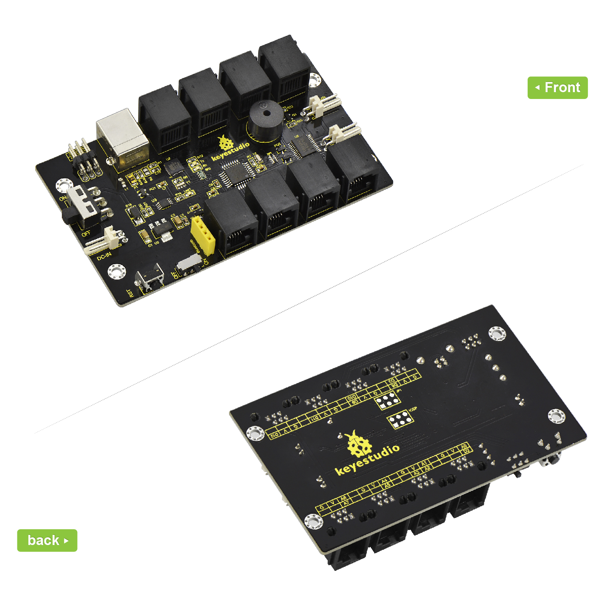

## Description:

The Keyestudio KEYBOT Coding Robot Control Board is particularly designed for
car robot control.

This control board has integrated the UNO R3 control board and a motor drive
board into one circuit board, which can directly drive two DC motors.

For the convenience of car design, this control board comes with a Bluetooth
interface (fully compatible with HC-06 Bluetooth module), 2 servo interfaces and
a passive buzzer.

For easy car control, this control board also comes with 2 slide switches and a
reset button. The large slide switch is used for an external power supply
control. While the small switch is used for the serial port communication of
Bluetooth module.

For simple connection, it extends all the digital and analog ports out as
telephone sockets. It also comes with a power interface. The telephone socket
integrates the digital and analog ports together, so you just need a cable to
connect it with sensor modules, pretty simple and convenient.

## Technical Details:

-   Main control chip: ATMEGA328P-AU

-   Motor drive chip: TB6612FNG

-   USB to serial chip: ATMEGA16U2-MU

-   Input voltage: DC 7-12V

-   Motor drive current: 1.2A (ave) / 3.2A (peak)

-   Standby current: 47mA

-   Comes with a passive buzzer: D13 control

-   Motor direction interface: D4 (motor A) and D7 (motor B)

-   Motor speed interface: D5 (motor A) and D6 (motor B)

-   Comes with 2 slide switches: power control switch (large one) and Bluetooth
    serial communication control switch (small one)

-   Comes with a Bluetooth interface: suitable for HC-06 Bluetooth, fixed
    direction, can not be connected if reversed.

-   Comes with 2 servo interfaces: D9 and D10 control respectively

-   Comes with a reset button

-   Comes with a power input interface

-   2 DC motor connection interfaces (labeled MA and MB)

-   It has 8 telephone sockets for external sensors and modules (internal with
    power interface). The control terminals are: D3 and D8, D9 and D10, D11,
    D12, D2 and A0, A1 A2 and A3, A4 and A5, A6 and A7.

## Dimensions:

-   105mm\*64mm\*18mm

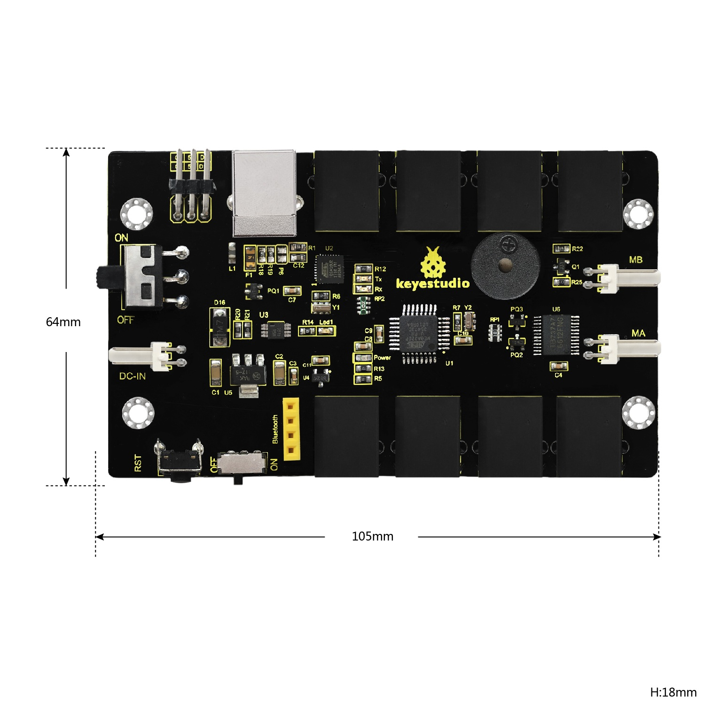

## 

## Element and Interfaces:

Here is an explanation of what every element and interface of the board does:

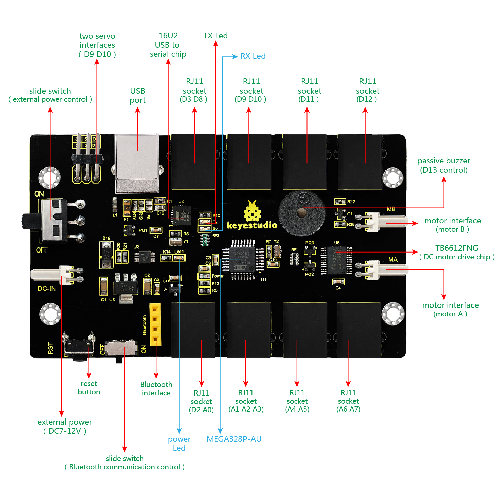

## 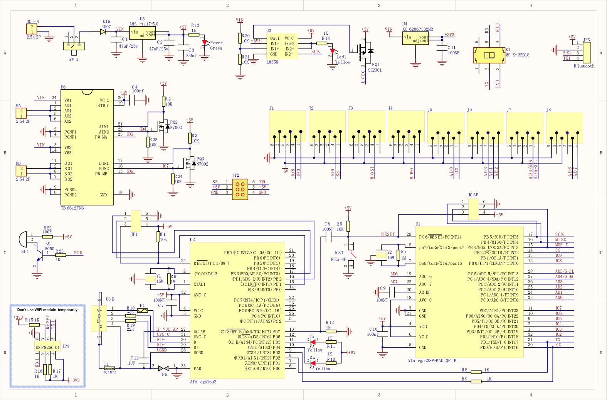Schematic Diagram:

## Detailed Test with ARDUINO Software as follows:

#### Step1 \| Download the Arduino environment (IDE)

When you get the board, first you should install the Arduino software and
driver.

We usually use the Windows software Arduino 1.5.6 version. You can download it
from the link below:

[https://www.arduino.cc/en/Main/OldSoftwareReleases\##1.5.x](https://www.arduino.cc/en/Main/OldSoftwareReleases##1.5.x)

Or you can browse the ARDUINO website to download the latest version from this
link, <https://www.arduino.cc>, pop up the following interface.

Then click the **SOFTWARE** on the browse bar, you will have two options ONLINE
TOOLS and DOWNLOADS.

Click **DOWNLOADS**, it will appear the latest software version of ARDUINO 1.8.5
shown as below.

In this software page, on the right side you can see the version of development
software for different operating systems. You should download the software that
is compatible with the operating system of your computer.

We will take **WINDOWS system** as an example here. There are also two options
under Windows system, one is installed version, the other is non-installed
version.

For simple installed version, first click **Windows Installer**, you will get
the following page.

This way you just need to click JUST DOWNLOAD, then click the downloaded file to
install it.

For non-installed version, first click Windows ZIP file, you will also get the
pop-up interface as the above figure.

Click JUST DOWNLOAD, and when the ZIP file is downloaded well to your computer,
you can directly unzip the file and click the icon of ARDUINO software to
install it.

#### Installing Arduino (Windows):

Install Arduino with the exe. Installation package downloaded well.

Click *“I Agree”* to see the following interface.

Click *“Next”*. Pop up the interface below.

You can press Browse… to choose an installation path or directly type in the
directory you want. Then click “Install” to initiate installation.

Wait for the installing process, if appear the interface of Window Security,
just continue to click Install to finish the installation.

#### Installing Driver:

The driver installation may have slight differences in different computer
systems. So in the following let’s move on to the driver installation in the WIN
7 system.

The Arduino folder contains both the Arduino program itself and the drivers that
allow the Arduino to be connected to your computer by a USB cable. Before we
launch the Arduino software, you are going to install the USB drivers.

Plug one end of your USB cable into the keyestudio coding robot control board
and the other into a USB socket on your computer.

When you connect keyestudio coding robot control board to your computer at the
first time, right click the icon of your *“Computer” —\>for “Properties”—\>
click the “Device manager”*, under “Other Devices”, you should see an icon for
“Unknown device” with a little yellow warning triangle next to it.

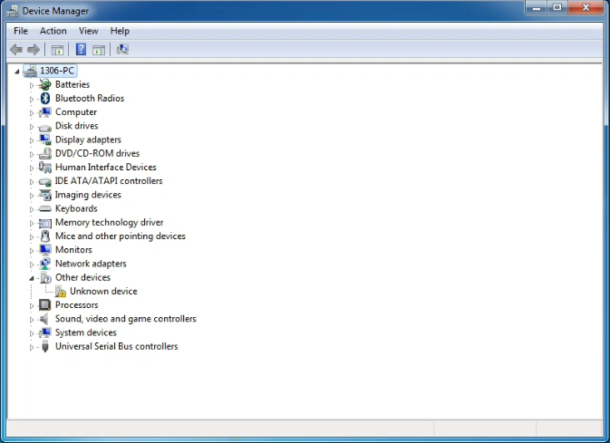

Then right-click on the device and select the top menu option (Update Driver
Software...) shown as the figure below.

It will then be prompted to either “Search Automatically for updated driver
software” or “Browse my computer for driver software”. Shown as below. In this
page, select “Browse my computer for driver software”.

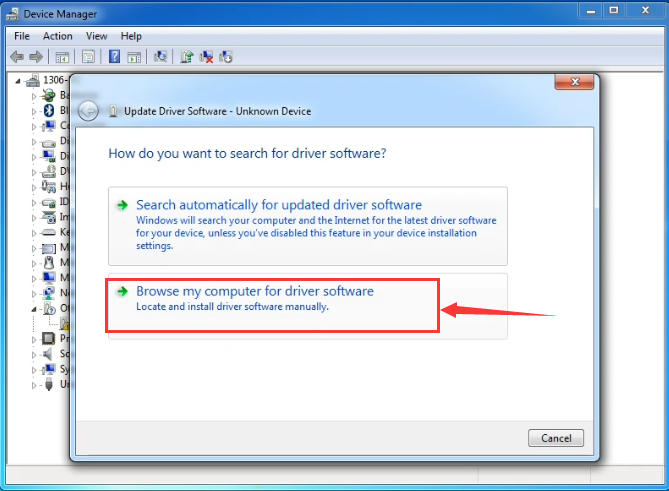

After that, select the option to browse and navigate to the “drivers” folder.

Click “Next” and you may get a security warning, if so, allow the software to be
installed. Shown as below.

Installation completed, click “Close”.

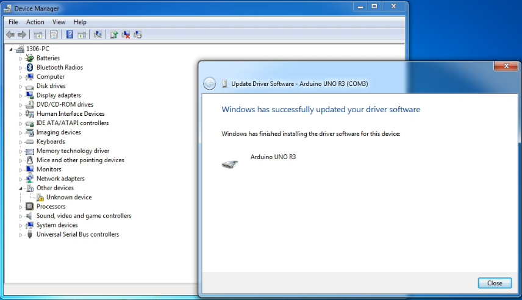

Up to now, the driver is
installed well. Then you can right click *“Computer” —\>“Properties”—\>“Device
manager”*, you should see the device shown below.

#### Introduction for Arduino IDE Toolbar:

Double-click the icon of Arduino software downloaded well, you will get the
interface shown below.

(Note: if the Arduino software loads in the wrong language, you can change it in
the preferences dialog. See [the environment
page](http://arduino.cc/en/Guide/Environment##languages) for details.)

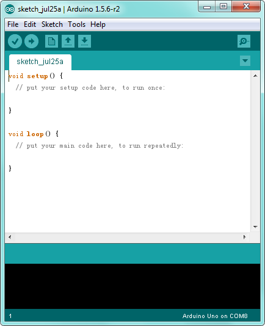

The functions of each button on the Toolbar are listed below:
<http://wiki.keyestudio.com/index.php/File:IDE.png>

| ****  **Verify/Compile** | Check the code for errors                           |
|------------------------------------------------------------------------------|-----------------------------------------------------|
| ****  **Upload**         | Upload the current Sketch to the Arduino            |
| **** **New**             | Create a new blank Sketch                           |
| **** **Open**            | Show a list of Sketches                             |
| **** **Save**            | Save the current Sketch                             |
| **** **Serial Monitor**  | Display the serial data being sent from the Arduino |

#### Step2\| Drive Two DC Motors

Below is an example code, you can copy and paste it on [Arduino
IDE](http://wiki.keyestudio.com/index.php/Download_Arduino_IDE).

\*\*\*\*\*\*\*\*\*\*\*\*\*\*\*\*\*\*\*\*\*\*\*\*\*\*\*\*\*\*\*\*\*\*\*\*\*\*\*\*\*\*\*\*\*\*\*\*\*\*\*\*\*\*\*\*\*\*\*\*\*\*\*\*\*\*\*\*

const int PWMA = 5; // define the left motor speed control of pin D5

const int PWMB = 6; // define the right motor speed control of pin D6

const int INT_A = 4; // define the left motor control of pin D4

const int INT_B = 7; // define the right motor control of pin D7

void setup()

{

pinMode(PWMA,OUTPUT); // set the pin of motor control as output

pinMode(PWMB,OUTPUT);

pinMode(INT_A,OUTPUT);

pinMode(INT_B,OUTPUT);

}

void loop()

{

digitalWrite(INT_A,HIGH); // the left motor rotates forward

digitalWrite(INT_B,HIGH); // the right motor rotates forward

analogWrite(PWMA,200); // the speed of left motor（PWM=200)

analogWrite(PWMB,200); // the speed of right motor（PWM=200)

delay(2000);

analogWrite(PWMA,0); // the speed of left motor（PWM=0)

analogWrite(PWMB,0); // the speed of right motor（PWM=0)

delay(2000);

digitalWrite(INT_A,LOW); // the left motor rotates backward

digitalWrite(INT_B,LOW); // the right motor rotates backward

analogWrite(PWMA,200); // the speed of left motor（PWM=200)

analogWrite(PWMB,200); // the speed of right motor（PWM=200)

delay(2000);

}

\*\*\*\*\*\*\*\*\*\*\*\*\*\*\*\*\*\*\*\*\*\*\*\*\*\*\*\*\*\*\*\*\*\*\*\*\*\*\*\*\*\*\*\*\*\*\*\*\*\*\*\*\*\*\*\*\*\*\*\*\*\*\*\*\*\*\*\*

#### Step3\| Upload the Code

Open the Arduino IDE, you’ll need to click the “Tools”, then select the Board
that corresponds to your Arduino and the serial port.

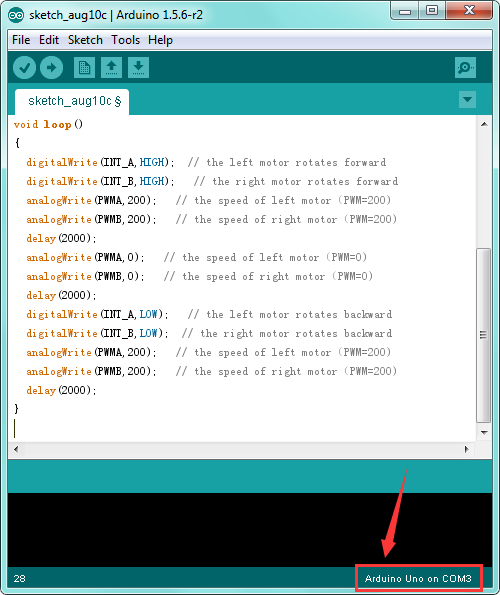

Then click the compile button, if compiling successfully, the message "Done
compiling." will appear in the status bar. Shown below.

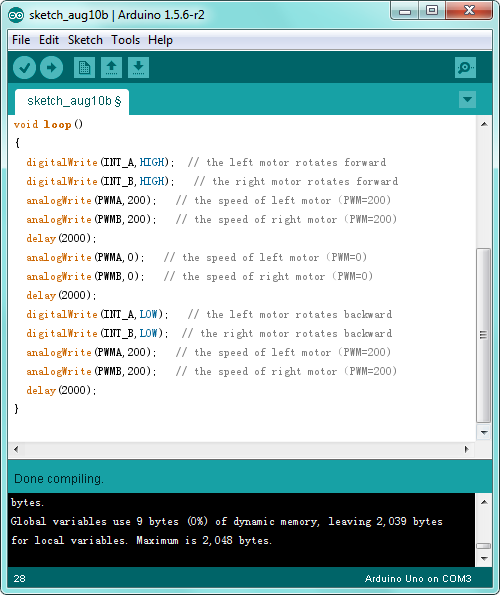

After that, click the “Upload”
button, if the upload is successful, the message "Done uploading." will appear
in the status bar.

#### Step4\| What You Should See

Done uploading, connect two DC motors to the control board, then supply DC 7-12V
power for the control board. Turn on the large slide switch, you should see the
two motors rotate forward for 2 seconds, stop 2 seconds then backward for 2
seconds, circularly.

**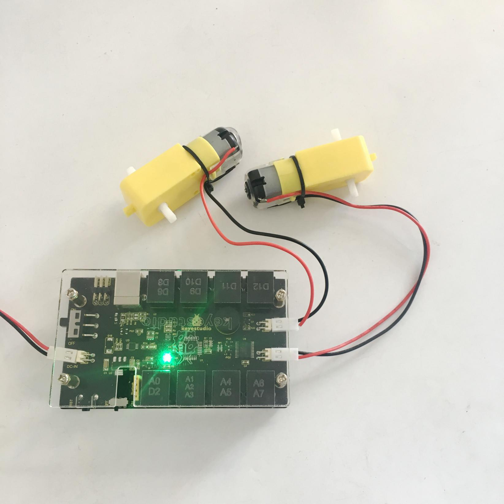**

